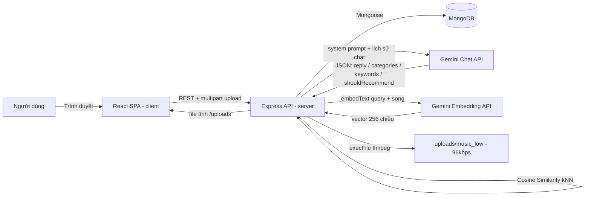
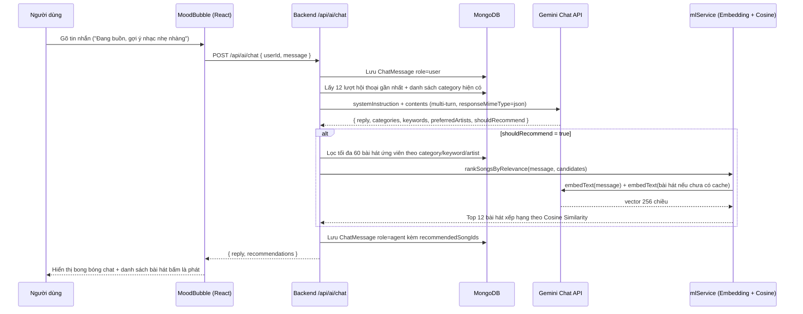

# IamNhac AI — Hệ thống AI Agent gợi ý nhạc theo yêu cầu người dùng

### Node.js/Express + React + MongoDB + Google Gemini (Chat + Embedding)

Nền tảng nghe nhạc trực tuyến tích hợp **AI Agent hội thoại (MoodBubble)**: người dùng chat bằng ngôn ngữ tự nhiên để mô tả tâm trạng/ngữ cảnh, AI hiểu ý và tự động gợi ý — rồi phát luôn — danh sách bài hát phù hợp.

[Đồ án môn Trí tuệ nhân tạo](#thông-tin-đồ-án--nhóm-thực-hiện) · [Kiến trúc tổng quan](#kiến-trúc-tổng-quan) · [Cài đặt nhanh](#cài-đặt-nhanh)


---

## Tổng quan

**IamNhac AI** là sản phẩm thực nghiệm của đề tài *"Hệ thống AI Agent gợi ý nhạc theo yêu cầu người dùng"*. Thay vì bắt người dùng tự bấm chọn thể loại/tâm trạng như các nền tảng nghe nhạc thông thường, hệ thống tích hợp trợ lý ảo **MoodBubble** — một bubble chat nổi trên mọi trang — cho phép người dùng gõ thẳng những câu như *"đang buồn, gợi ý nhạc tâm trạng nhé"* hoặc *"học bài chạy deadline, cần nhạc tập trung"* và nhận lại ngay danh sách nhạc phù hợp, bấm là phát.

Kiến trúc AI Agent gồm 2 lớp phối hợp với nhau:

1. **LLM (Google Gemini)** đóng vai trò "bộ não ngôn ngữ": đọc lịch sử hội thoại nhiều lượt, trò chuyện tự nhiên bằng tiếng Việt, và luôn trả về kèm theo 1 object JSON chứa tiêu chí tìm nhạc (`categories`, `keywords`, `preferredArtists`, `shouldRecommend`).
2. **Machine Learning (Gemini Embedding + Cosine Similarity / k-Nearest Neighbors)** đóng vai trò "bộ lọc ngữ nghĩa": biến câu chat và từng bài hát ứng viên thành vector số, rồi xếp hạng để chọn ra bài **gần với đúng ý câu chat hiện tại nhất** — chứ không chỉ dừng ở việc khớp thể loại chung chung.

Phần Backend đóng vai trò điều phối: lọc sơ bộ ứng viên trong MongoDB theo tiêu chí Gemini trả về, đưa qua bước ML để xếp hạng lại, sau đó trả kết quả cho Frontend để hiển thị trong bubble chat và đẩy thẳng vào trình phát nhạc toàn cục.

## Tính năng chính

- **AI Agent hội thoại — MoodBubble**: Chat đa lượt bằng tiếng Việt với Gemini; nếu ngữ cảnh chưa đủ rõ, AI chủ động hỏi lại thay vì gợi ý bừa; lưu và khôi phục lại lịch sử hội thoại mỗi khi mở lại bubble hoặc tải lại trang.
- **Machine Learning re-ranking**: Mỗi bài hát (`title - artist - category`) và mỗi câu chat được nhúng thành vector 256 chiều bằng Gemini Embedding API, so khớp bằng Cosine Similarity để xếp hạng mức độ liên quan; embedding của bài hát được cache lại trong MongoDB để không phải gọi lại API mỗi lượt chat.
- **Trình phát nhạc toàn cục (Global Player)**: Dùng React Context API để nhạc không bị ngắt khi chuyển trang; hỗ trợ chuyển đổi **Chất lượng cao / Chất lượng thấp (96kbps, tiết kiệm dữ liệu)** ngay trong lúc đang phát.
- **Quản lý thư viện cá nhân**: Đăng nhạc kèm ảnh bìa và thể loại, tạo/xoá playlist, thêm - bớt bài hát khỏi playlist, xem lại thư viện đã đăng.
- **Bảng xếp hạng (Ranking)**: Top 10 bài hát nhiều lượt Like nhất, tính bằng MongoDB aggregation.
- **Trang quản trị (Admin Dashboard)**: Admin xem, sửa, xoá bài hát của bất kỳ người dùng nào trên toàn hệ thống (CRUD đầy đủ).
- **Xác thực & phân quyền**: Đăng ký/đăng nhập bằng JWT (HS256), mật khẩu hash bằng bcrypt; mọi route sửa hồ sơ/bài hát đều kiểm tra chủ sở hữu hoặc quyền admin trước khi cho ghi dữ liệu.
- **Hồ sơ cá nhân**: Đổi ảnh đại diện, chỉnh bio, xem lại danh sách nhạc đã đăng theo từng người dùng.

## Kiến trúc thư mục

```
Iamnhac-ai/
└── project/
    ├── client/                        React SPA (Create React App)
    │   ├── public/
    │   └── src/
    │       ├── api/aiApi.js            Gọi REST tới AI Agent (/api/ai/*)
    │       ├── components/
    │       │   ├── GlobalPlayer.jsx    Trình phát nhạc toàn cục + toggle chất lượng
    │       │   ├── MoodBubble/         Bubble chat AI Agent
    │       │   └── NotificationProvider.jsx
    │       ├── context/MusicContext.js Global state cho trình phát nhạc
    │       ├── pages/                  Home, Search, Ranking, Library, Playlist,
    │       │                           Auth (Login/Register), Admin (Upload/Dashboard),
    │       │                           Focus (Pomodoro - thử nghiệm), Profile
    │       └── styles/
    ├── server/                        Node.js + Express API
    │   ├── src/
    │   │   ├── config/db.js            Kết nối MongoDB (Mongoose)
    │   │   ├── controllers/            auth, song, playlist, ai, user
    │   │   ├── middlewares/uploadMiddleware.js  Multer, giới hạn 20MB/file
    │   │   ├── models/                 User, Song, Playlist, ChatMessage
    │   │   ├── routes/                 authRoutes, songRoutes, playlistRoutes, aiRoutes
    │   │   └── services/
    │   │       ├── geminiService.js        Gọi Gemini Chat API + system prompt của Agent
    │   │       ├── mlService.js            Embedding + Cosine Similarity (kNN)
    │   │       └── audioTranscodeService.js Transcode 96kbps bằng ffmpeg
    │   ├── backfillEmbeddings.js       Script tính lại embedding cho nhạc cũ
    │   ├── backfillLowQuality.js       Script tạo bản 96kbps cho nhạc cũ
    │   ├── .env.example
    │   └── server.js
    ├── database/scripts/               init_schema.sql (khung tham khảo — DB chính là MongoDB/NoSQL)
    ├── docs/requirements/              Tài liệu phân tích yêu cầu
    ├── RUN_PROJECT.bat                 Chạy nhanh server + client (Windows)
    └── run_app.bat                     Biến thể chạy nhanh khác (Windows)
```

## Tech stack

| Lớp                     | Công nghệ                                                        | Vai trò                                                                                     |
| ------------------------ | ------------------------------------------------------------------ | ---------------------------------------------------------------------------------------------- |
| Frontend                 | React 18, React Router DOM 6, Axios, lucide-react                  | SPA, điều hướng client-side, gọi REST API, icon.                                            |
| State nhạc toàn cục      | React Context API (`MusicContext`)                                 | Giữ trình phát nhạc không bị gián đoạn/reload khi chuyển trang.                             |
| Backend                  | Node.js, Express.js                                                 | REST API, xử lý upload, điều phối AI Agent.                                                 |
| Xác thực                 | `jsonwebtoken`, `bcryptjs`                                          | Đăng nhập bằng JWT, hash mật khẩu, phân quyền `user`/`admin`.                                |
| Database                 | MongoDB, Mongoose                                                   | Lưu user, bài hát, playlist, lịch sử chat và vector embedding.                               |
| Upload file               | Multer                                                              | Nhận file nhạc/ảnh, giới hạn 20MB, tách thư mục `uploads/music` và `uploads/images`.         |
| AI Agent — Chat           | Google Gemini API (`gemini-2.5-flash` mặc định, cấu hình qua env)   | "Bộ não" hội thoại; trả lời tự nhiên + trích xuất tiêu chí tìm nhạc dạng JSON.                |
| Machine Learning          | Gemini Embedding API (`gemini-embedding-001`, 256 chiều) + Cosine Similarity | Xếp hạng bài hát ứng viên theo mức độ liên quan ngữ nghĩa với câu chat hiện tại (kNN).        |
| Xử lý âm thanh            | ffmpeg (qua `child_process`)                                        | Transcode bản nhạc 96kbps phục vụ "Chất lượng thấp / tiết kiệm dữ liệu".                     |
| Chạy local                | `RUN_PROJECT.bat` / `run_app.bat`                                    | Khởi động song song backend (port 5000) và frontend (port 3000) trên Windows.                |

## Kiến trúc tổng quan



    Loading

## Luồng hoạt động AI Agent (bubble chat MoodBubble)



    Loading

## Giới hạn hiện tại và hướng phát triển

Phần này được nêu rõ để phản biện thấy phạm vi đồ án minh bạch. IamNhac AI hiện là sản phẩm demo phục vụ báo cáo môn học, chưa tự nhận là hệ thống production hoàn chỉnh.

### Giới hạn hiện tại

| Vấn đề                  | Hiện trạng                                                                                                       | Lý do chấp nhận trong phạm vi đồ án                                                             |
| ------------------------- | -------------------------------------------------------------------------------------------------------------------- | ------------------------------------------------------------------------------------------------- |
| Model AI mặc định         | `GEMINI_MODEL` mặc định là `gemini-2.5-flash`.                                                   | Model miễn phí, hạn mức free-tier rộng, đủ ổn định cho demo học thuật; đổi được qua biến môi trường, không cần sửa code. |
| Lưu trữ vector             | Embedding 256 chiều lưu trực tiếp trong field `Song.embedding` (MongoDB), so khớp bằng vòng lặp JS thay vì chỉ mục vector chuyên dụng. | Phù hợp quy mô kho nhạc demo; đủ nhanh cho khối lượng dữ liệu hiện tại.                            |
| API base URL               | Frontend gọi thẳng `http://localhost:5000` (hard-code) ở nhiều component thay vì đọc từ biến môi trường.            | Đơn giản hoá khi chạy demo trên 1 máy; cần đổi sang cấu hình `.env` khi triển khai thật.           |
| Chất lượng âm thanh thấp   | Transcode 96kbps phụ thuộc `ffmpeg` cài sẵn trên máy chủ; nếu thiếu, tính năng tự fallback về file gốc.              | Không chặn luồng upload chính khi thiếu công cụ ngoài; trải nghiệm vẫn hoạt động bình thường.      |
| Cá nhân hoá dài hạn         | AI Agent chỉ dùng lịch sử chat (`ChatMessage`) theo từng tài khoản, chưa có hồ sơ "gu nhạc" tổng hợp riêng biệt.     | Đủ cho luồng hội thoại tức thời trong phạm vi đồ án; là hướng mở rộng tự nhiên.                    |
| Tài liệu CSDL / yêu cầu     | `database/scripts/init_schema.sql` và `docs/requirements/requirements.txt` hiện là file khung, chưa có nội dung.    | MongoDB là NoSQL nên không bắt buộc schema SQL; tài liệu yêu cầu đang được nhóm hoàn thiện song song. |

### Hướng phát triển

- **Vector Database chuyên dụng**: chuyển embedding từ mảng trong MongoDB sang Pinecone, Milvus hoặc MongoDB Atlas Vector Search khi kho nhạc mở rộng lên hàng chục nghìn bài.
- **Chuẩn hoá cấu hình Frontend**: dùng `REACT_APP_API_URL` thay vì hard-code `localhost:5000`, phục vụ triển khai đa môi trường (dev/staging/production).
- **Rate limiting** cho route `/api/ai/chat` để tránh spam làm hao hụt hạn mức Gemini free-tier.
- **Streaming response (SSE)** để bubble chat hiển thị AI "gõ chữ" từng phần thay vì chờ trọn câu trả lời.
- **Thuật toán gợi ý lai (Hybrid)**: kết hợp thêm Collaborative Filtering từ lượt Play/Like thực tế của cộng đồng, không chỉ Content-based từ embedding câu chat.
- **Voice command**: tích hợp Speech-to-Text để ra lệnh bằng giọng nói, tương tự Siri/Google Assistant.
- **Tính năng xã hội**: nghe nhạc cùng lúc theo thời gian thực giữa nhiều người dùng (Listen Party).
- **CI/CD & container hoá**: GitHub Actions kiểm tra chất lượng mã, đóng gói backend bằng Docker cho môi trường production.

## Cài đặt nhanh

```bash
# 1. Clone project
git clone https://github.com/Gitsoul2k4/Iamnhac-ai.git
cd Iamnhac-ai/project

# 2. Cài dependencies & cấu hình Backend
cd server
npm install
cp .env.example .env
# Điền MONGO_URI, JWT_SECRET và GEMINI_API_KEY (lấy miễn phí tại
# https://aistudio.google.com/app/apikey) vào file .env vừa tạo

# 3. Cài dependencies Frontend
cd ../client
npm install

# 4a. Chạy nhanh cả 2 server cùng lúc (Windows)
cd ..
RUN_PROJECT.bat        # hoặc run_app.bat

# 4b. Hoặc chạy tay từng phần (mọi hệ điều hành)
cd server && npm run dev     # API tại http://localhost:5000
cd client && npm start       # Web tại http://localhost:3000
```

Tuỳ chọn — chạy các script backfill 1 lần khi nâng cấp tính năng AI/ML cho dữ liệu nhạc đã có từ trước:

```bash
cd server
node backfillEmbeddings.js     # Tính embedding cho bài hát chưa có (phục vụ AI Agent)
node backfillLowQuality.js     # Tạo bản 96kbps cho bài hát chưa có (cần cài ffmpeg)
```

## API chính

| Method   | Endpoint                     | Mô tả                                                                             |
| -------- | ----------------------------- | ------------------------------------------------------------------------------------ |
| `POST`   | `/api/auth/register`          | Đăng ký tài khoản.                                                                 |
| `POST`   | `/api/auth/login`              | Đăng nhập, trả về JWT + thông tin user.                                            |
| `GET`    | `/api/songs`                   | Lấy toàn bộ bài hát.                                                               |
| `GET`    | `/api/songs/search?q=`         | Tìm kiếm theo tên bài hát hoặc nghệ sĩ.                                            |
| `GET`    | `/api/songs/user/:userId`      | Danh sách bài hát đã đăng của 1 người dùng.                                        |
| `GET`    | `/api/songs/info/:userId`      | Thông tin hồ sơ (profile) của người dùng.                                         |
| `POST`   | `/api/songs/upload`            | Upload bài hát (`songFile`, `imageFile`) — tự tính embedding và transcode 96kbps ngầm. |
| `POST`   | `/api/songs/like/:id`          | Like / Unlike bài hát.                                                             |
| `PUT`    | `/api/songs/:id`               | Sửa thông tin bài hát (admin hoặc chủ sở hữu).                                     |
| `POST`   | `/api/songs/avatar/:id`        | Đổi ảnh đại diện.                                                                  |
| `PUT`    | `/api/songs/user/:id`          | Cập nhật hồ sơ (username, bio).                                                    |
| `DELETE` | `/api/songs/:id`               | Xoá bài hát (admin hoặc chủ sở hữu).                                               |
| `GET`    | `/api/songs/ranking`           | Top 10 bài hát nhiều lượt Like nhất.                                               |
| `GET`    | `/api/playlists/user/:userId`  | Danh sách playlist của 1 người dùng.                                               |
| `GET`    | `/api/playlists/:id`           | Chi tiết 1 playlist.                                                               |
| `POST`   | `/api/playlists`               | Tạo playlist mới.                                                                  |
| `PUT`    | `/api/playlists/:id/add`       | Thêm bài hát vào playlist.                                                         |
| `PUT`    | `/api/playlists/:id/remove`    | Xoá bài hát khỏi playlist.                                                         |
| `DELETE` | `/api/playlists/:id`           | Xoá toàn bộ playlist.                                                              |
| `POST`   | `/api/ai/chat`                 | Gửi tin nhắn cho AI Agent, nhận `{ reply, recommendations }`.                       |
| `GET`    | `/api/ai/chat/:userId`         | Lấy lại lịch sử hội thoại (kèm bài hát đã gợi ý).                                   |
| `DELETE` | `/api/ai/chat/:userId`         | Xoá lịch sử hội thoại, bắt đầu phiên mới.                                          |

## Biến môi trường

| Biến                      | Mặc định / ví dụ                          | Ghi chú                                                                                     |
| --------------------------- | -------------------------------------------- | ----------------------------------------------------------------------------------------------- |
| `PORT`                      | `5000`                                       | Cổng chạy Backend.                                                                            |
| `MONGO_URI`                 | `mongodb://localhost:27017/iamnhac`          | Chuỗi kết nối MongoDB.                                                                        |
| `JWT_SECRET`                | —                                             | Khoá ký JWT, bắt buộc đặt giá trị riêng khi triển khai thật.                                   |
| `GEMINI_API_KEY`            | —                                             | Lấy miễn phí tại [Google AI Studio](https://aistudio.google.com/app/apikey).                   |
| `GEMINI_MODEL`               | `gemini-2.5-flash`                           | Model dùng cho bubble chat AI Agent; đổi model chỉ cần sửa biến này, không cần sửa code.        |
| `GEMINI_EMBEDDING_MODEL`     | `gemini-embedding-001`                       | Model sinh vector embedding phục vụ bước Machine Learning (Cosine Similarity / kNN).           |

Không commit file `.env` hay bất kỳ API key thật nào lên repository — `.gitignore` đã loại trừ sẵn `project/server/.env` và `project/server/uploads/`.

## Thông tin đồ án & nhóm thực hiện

Sản phẩm **IamNhac AI** là kết quả bài tập lớn môn **Trí tuệ nhân tạo**, đề tài *"Hệ thống AI Agent gợi ý nhạc theo yêu cầu người dùng"*, Viện Công nghệ thông tin và Điện, Điện tử — Trường Đại học Giao thông vận tải TP. Hồ Chí Minh.

| STT | MSSV          | Họ & Tên               | Vai trò                          |
| --- | ------------- | ---------------------- | ---------------------------------|
| 1   | 2251120025    | Nguyễn Thanh Lâm       | Backend & Tích hợp AI Agent      |
| 2   | 2551120018    | Trần Gia Huy           | Backend & Tích hợp AI Agent      |
| 3   | 2251120010    | Phạm Nguyên Đồng       | Thiết kế CSDL & Soạn báo cáo     |
| 4   |               | Lê Hữu Đan             | Frontend & Soạn báo cáo          |
| 5   |               | Dương Bích Tuyền       | Vẽ sơ đồ & Soạn báo cáo          |
| 6   |               | Nguyễn Thành Đạt       | Frontend & Soạn báo cáo          |

Giảng viên hướng dẫn: **Ths. Bùi Trọng Hiếu**

## License

Dự án phục vụ mục đích học tập / báo cáo môn học. Nếu muốn công bố mã nguồn rộng rãi, nhóm khuyến nghị bổ sung file `LICENSE` (ví dụ MIT) vào repository.
